# BTC Visualization Library

## Overview

This repository provides a comprehensive system for tracking tennis shot and point-level data, visualizing it with D3.js. The data is captured at a coordinate level and then processed to generate visuals that help quantify performance or identify areas for improvement. This can be used by tennis players and coaches to inform training, strategy, and match analysis.

## Datasets

### 1. `shot.csv`

This dataset tracks **coordinate-level data** for each shot during a match, providing information such as the type of shot, where it was hit on the court, and where it landed.

| shotType | spinType | hitLocation         | landLocation        |
| -------- | -------- | ------------------- | ------------------- |
| forehand | topspin  | bottom right corner | middle of the court |

Each row in `shot.csv` provides detailed shot placement and characteristics, including shot type (e.g., forehand, lob), spin type (e.g., topspin), and the specific coordinates for where the shot was hit and landed on the court.

### 2. `point.csv`

This dataset condenses the shot-level data into **point-level information**. Each row represents a single point, including:

- **Server Name**
- **Serve Result**
- **Return Result**
- **Serve+1 Result** (the third shot of the point)
- **Return+1 Result** (the fourth shot of the point)
- **Rally Count**
- **End with Winner** (boolean)
- **End with Unforced Error** (boolean)

The combination of `shot.csv` and `point.csv` allows for powerful analysis, such as examining serve success rates or identifying shot patterns during rallies.

## Visualizations

The visuals generated from this data help to uncover patterns in a player's performance and provide a visual representation of key metrics. These visualizations are primarily built using **D3.js**, a powerful JavaScript library for producing dynamic, interactive data visualizations. D3 is ideal for coordinate data because it provides fine-grained control over the representation of each data point, allowing for flexible and responsive visualizations that adapt to different shot and court positions.

### Example Visuals

1. **Return of Serve Contact Points**  
   This visualization shows the location of return of serve shots, where the player made contact with the ball, and the outcome of the point.

   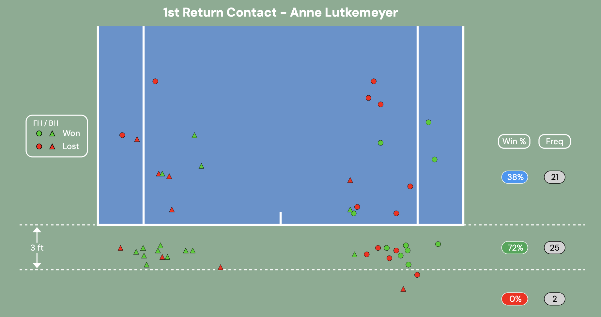

2. **1st Return Placement**  
   Depicts placement and direction of return of serve shots along with distribution of shots and point outcome. Further filtering is possible for side and ground stroke type (e.g. Ad returns or Deuce Forehand returns only)

   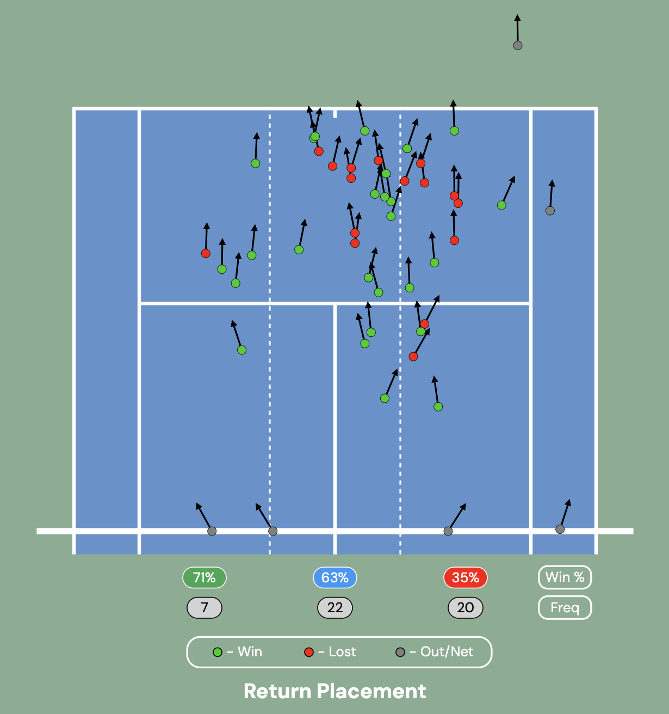

   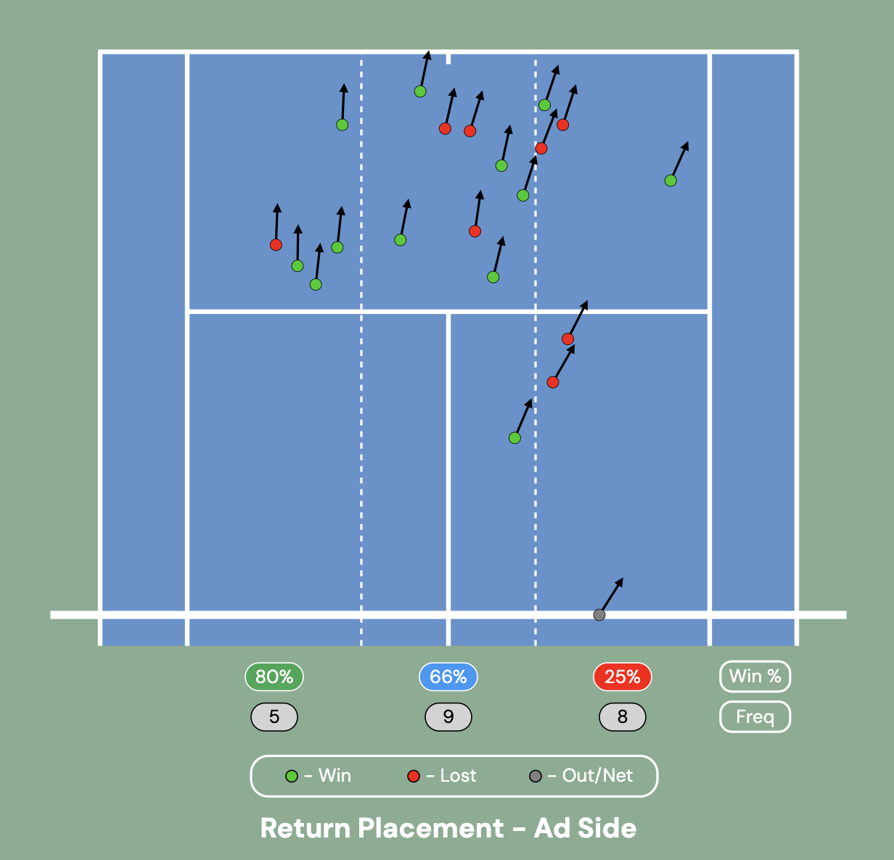

   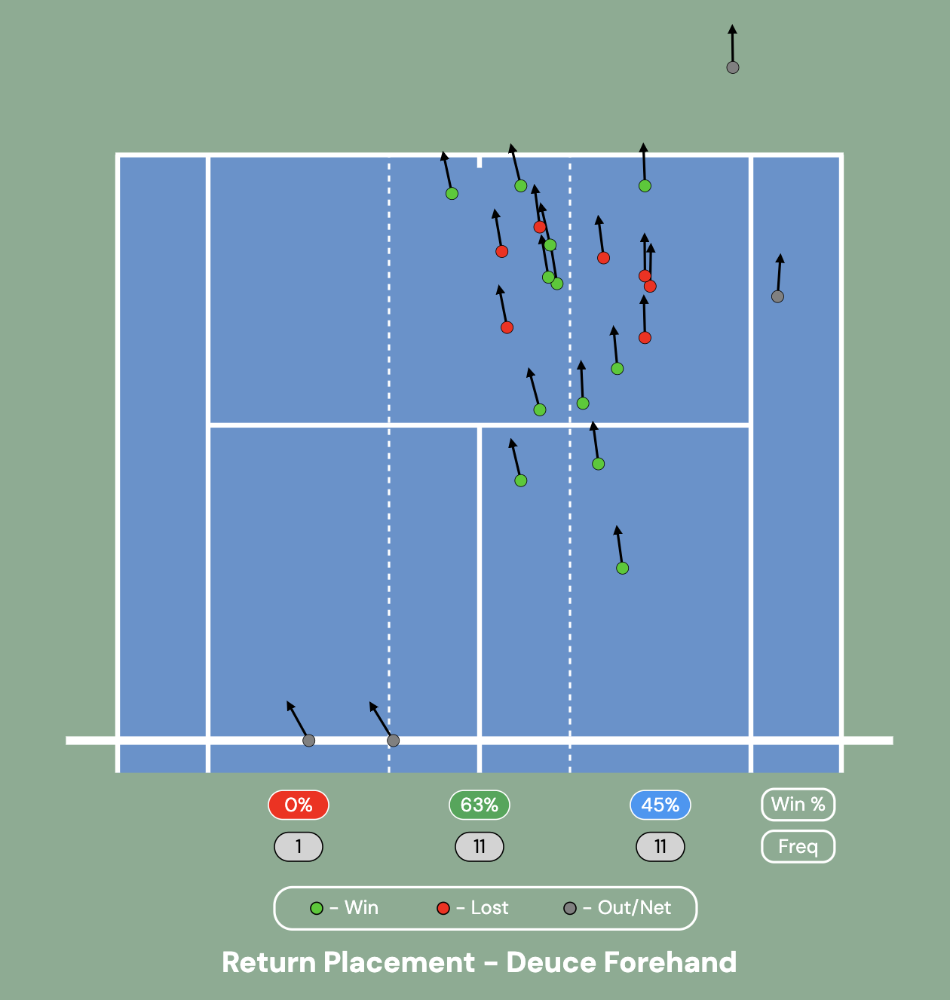

3. **Serve Error Heatmap**  
   A heatmap that tracks where serves are missing, providing insights on serve accuracy and tendencies.

   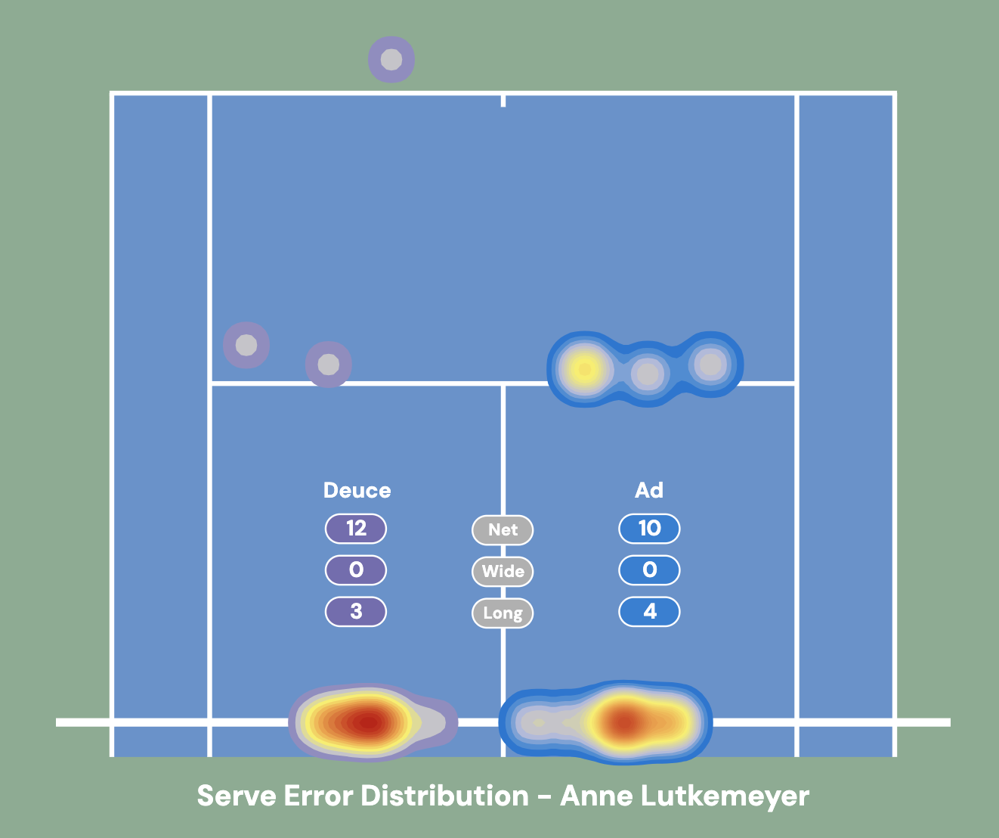

4. **Winner Placement**  
   Shows placement and direction of winner shots (shots untouched by the opponent), distinguished by shot type: forehand, backhand, or volley.

   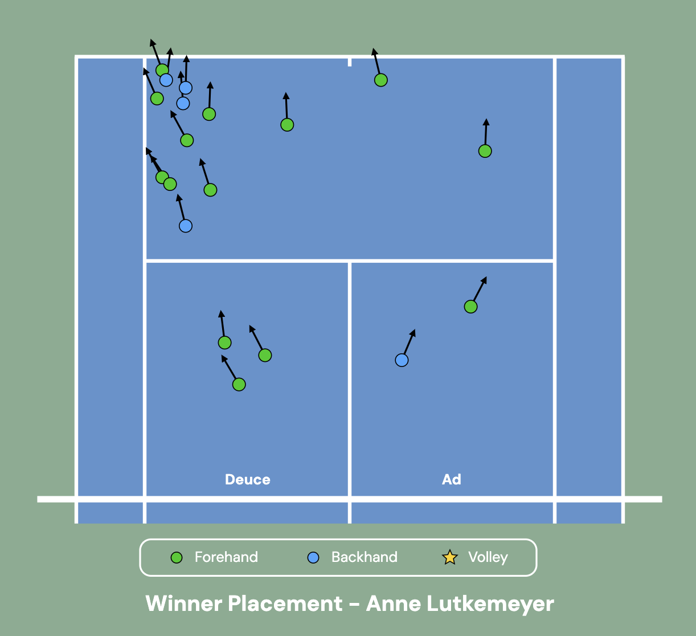

5. **Summary Statistics**  
   This graphic offers a detailed comparison of match statistics, highlighting performance metrics such as aces, double faults, serve success rates, break points saved, and rally lengths. It provides valuable insights into key performance differences.

   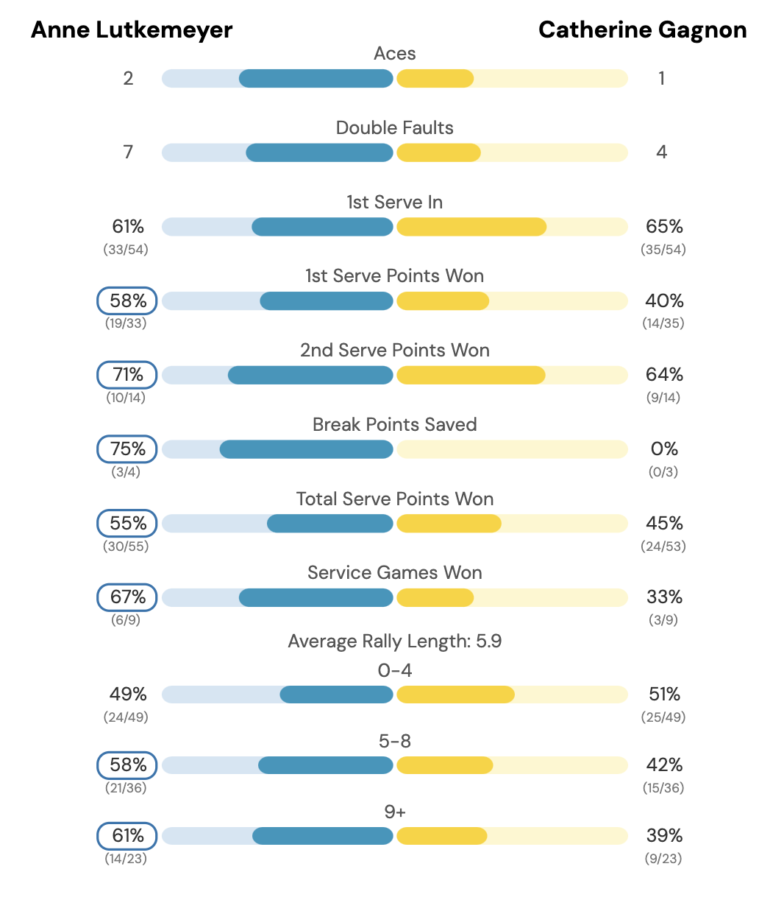

6. **Serve Result by Location**  
   This visual combines serve location data with point outcome, showing where serves land and whether the point was won or lost, with different colors indicating the result.

   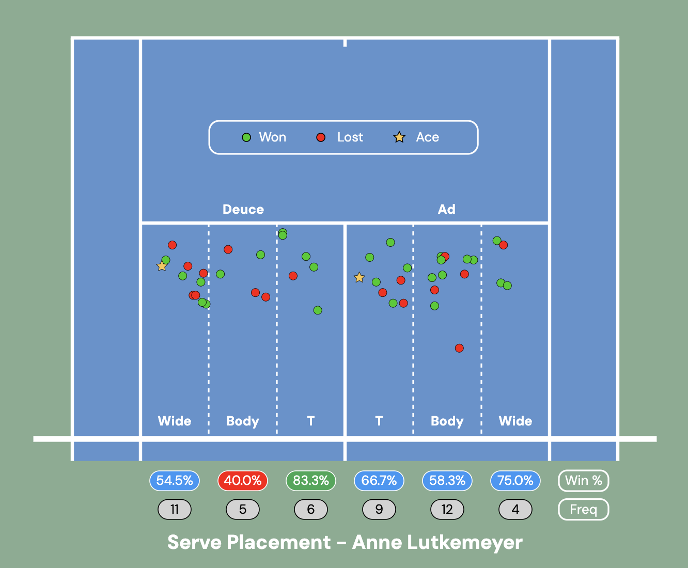

7. **Serve Distribution**  
   Similar to the previous visual, this visual combines serve data with point outcome, showing the distribution of serve placement in terms of frequency and corresponding point win percentage.

   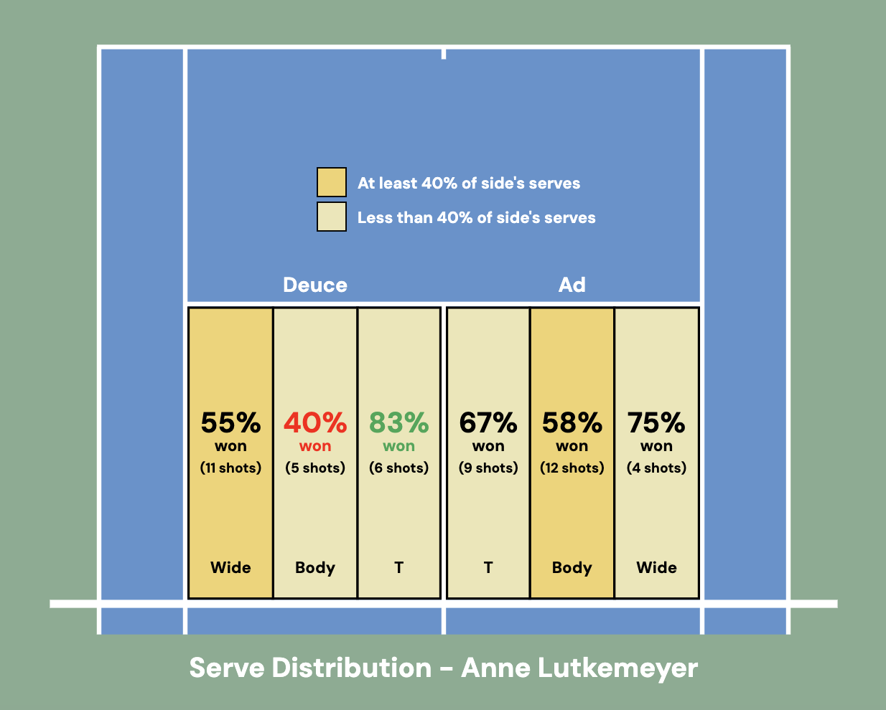

8. **Net Errors**  
   Depicts contact point and direction of net errors along with color distinction of ground stroke type.

   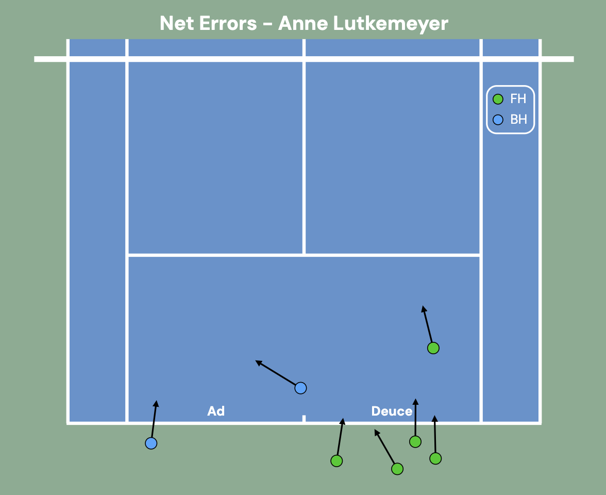

These visualizations can be combined with tennis domain knowledge to:

1. **Quantify Good Results**: For example, understanding the areas on the court where serves or shots lead to successful outcomes.
2. **Show Errors and Suggest Alternative Options**: By visualizing errors, we can suggest different shot placements or strategies that might reduce the likelihood of unforced errors and improve overall point-winning potential.

## Future Developments

We are working on advanced visualizations such as:

- **Point Replay (Bird-Eye View)**  
   A bird-eye view replay of points, allowing for a clearer understanding of point construction and shot decisions.  
   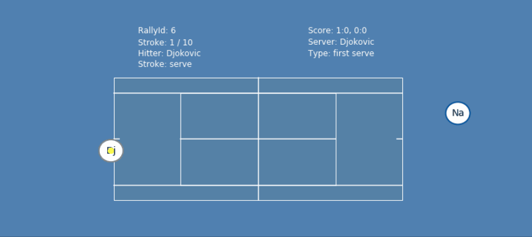

- **3D Visual Playback**  
   While not yet implemented, our goal is to create 3D playback visualizations similar to what IBM provides at the US Open. This will give players and coaches even more insight into movement and positioning on the court.  
   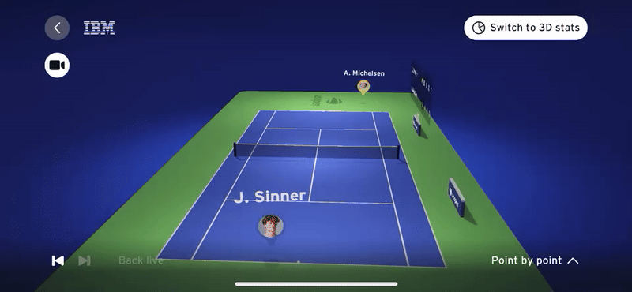  
   Note: The example shown here is from IBM's US Open analysis and is not part of this project.

## Consulting Process

We meet with players weekly to assist in **film review** and discuss their performance analytics. By breaking down match data and visualizations, we help players identify which areas to focus on in training. This is one of the key benefits of using analytics in tennis – **the ability to make data-driven decisions about practice and strategy**.

---

Feel free to reach out for more information, or if you're interested in utilizing these analytics for player performance tracking and match analysis!
